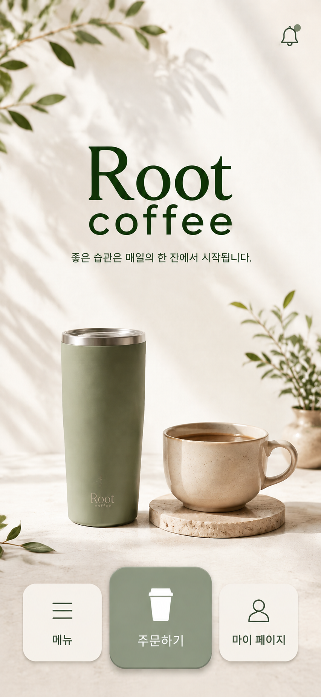
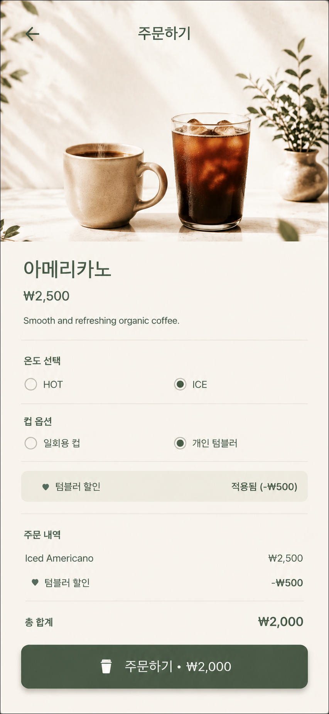
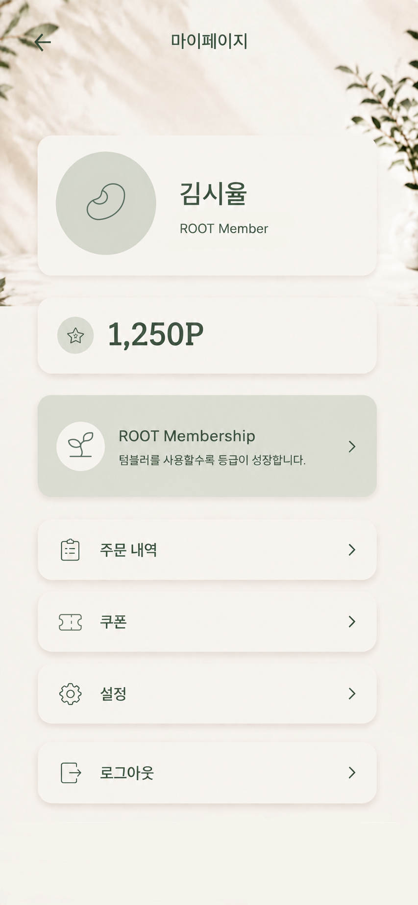
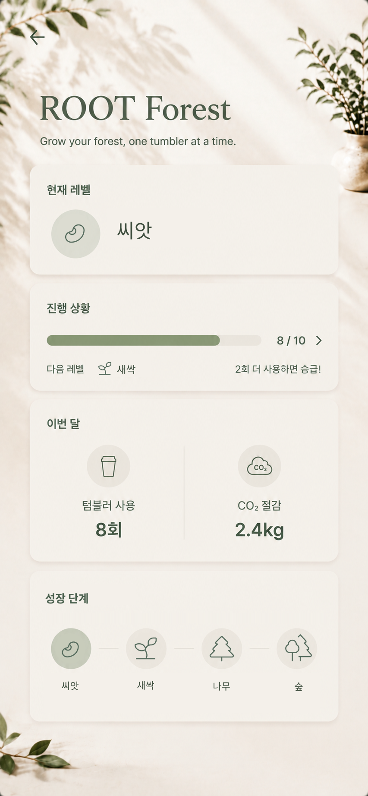

# B2-1 [Project A] AI 기반 UI/UX 디자인 시안 제작  

## 1. 프로젝트 개요
 + **서비스 명칭:** 'Root Coffee' 모바일 앱
 + **서비스 컨셉:** "좋은 습관은 매일의 한 잔에서 시작됩니다."라는 슬로건 아래, 편리한 주문 시스템과 친환경적인 가치(텀블러 사용)를 결합한 **지속 가능한 라이프 스타일 카페 앱**
 + **주요 타겟:** 미니멀하고 트렌디한 디자인을 선호하며, 환경 보호와 가치 소비에 관심이 많은 2030세대
 + **핵심 기능**  
  \- 스마트오더(Smart Order): 기다림 없는 비대면 메뉴 주문 및 결제  
  \- 주문 현황 확인: 실시간 제조 상태 확인 및 픽업 알림  
  \- 에코 베네핏(Eco-Benefit): 텀블러 사용 시 자동 할인 적용 및 환경 기여도(에코 스탬프) 확인 가능  

## 2. 사용 도구
 + **이미지 생성 AI:** Chat GPT
 + **후가공 도구:** Figma

## 3. 프롬프트 최적화 과정
 + **AI 이미지 생성 전략**  
  \- AI 이미지 생성 시 동일한 **레퍼런스 스타일**을 고정하여 앱의 전체 디자인 일관성을 확보하였다. 또한 화면 상단에 **[Main Page],[Order Page],[My Page]** 등 페이지 역할을 명시하여, AI가 각 화면을 별개의 이미지가 아니라 **하나의 서비스 안에서 연결되는 UI 화면**으로 이해하도록 돕는 역할을 하였다. 그 결과, 동일한 디자인을 유지하면서도 각 페이지의 기능적 차이를 반영한 이미지를 생성할 수 있었다.

+ <h3>메인페이지</h3>

<table>
  <thead>
    <tr>
      <th width="10%">단계</th>
      <th width="45%">프롬프트</th>
      <th width="45%">결과 및 개선점</th>
    </tr>
  </thead>
  <tbody>
    <tr>
      <td align="center">초안</td>
      <td>
        Eco-friendly coffee app UI, minimal, green theme.
      </td>
      <td>
        • 친환경 카페의 분위기는 표현되었지만 브랜드 아이덴티티와 메인 화면 UI 구성이 부족했음. 
        • UI보다 배경 이미지 중심으로 생성되어 실제 앱 화면과 차이가 있었음. 
        • 버튼 구성과 브랜드 로고 등 핵심 요소가 충분히 반영되지 않았음.
      </td>
    </tr>
    <tr>
      <td align="center">수정</td>
      <td>
        Minimal and trendy mobile app UI for Root Coffee, warm ivory background, muted sage green palette,
        centered ROOT COFFEE logo, Korean slogan, reusable tumbler, three rounded navigation buttons
        (Menu, Order, My Page), generous whitespace, premium mobile UI.
      </td>
      <td>
        • 브랜드 아이덴티티(미니멀·트렌디·친환경)가 자연스럽게 반영됨. 
        • 로고, 슬로건, 버튼 구성이 추가되어 메인 화면 형태를 갖추게 되었음. 
        • 버튼 디자인과 배치는 원하는 방향에 가까워졌지만, 로고의 폰트와 색상은 추가 수정이 필요했음.
      </td>
    </tr>
    <tr>
      <td align="center">최종</td>
      <td>
        High-fidelity iPhone 14 Pro home screen for Root Coffee, premium minimalist UI, elegant serif logo,
        unified typography for "Root coffee", muted sage green logo color, regular font weight, Korean slogan,
        reusable tumbler, warm coffee still-life, preserve all layout and UI elements unchanged except logo typography.
      </td>
      <td>
        • 브랜드 로고의 폰트와 색상을 브랜드 콘셉트에 맞게 개선하여 완성도를 높였음. 
        • 기존 레이아웃, 버튼, 이미지, 색상은 유지하면서 로고만 반복 수정하여 디자인의 일관성을 확보했음. 
        • 미니멀하고 친환경적인 브랜드 아이덴티티를 효과적으로 전달하는 최종 메인 페이지 UI를 완성함.
      </td>
    </tr>
  </tbody>
</table>

+ <h3>주문 페이지</h3>

<table>
  <thead>
    <tr>
      <th width="10%">단계</th>
      <th width="45%">프롬프트</th>
      <th width="45%">결과 및 개선점</th>
    </tr>
  </thead>
  <tbody>
    <tr>
      <td align="center">초안</td>
      <td>
        Create a mobile Order screen for Root Coffee. Use the Home screen as the style reference.
        Include a back button, product image, Americano, ₩2,500, product description,
        temperature selection (HOT/ICE), cup option, tumbler discount, order summary,
        and a fixed Place Order button.
      </td>
      <td>
        • 홈 화면과 유사한 분위기는 표현되었으나 일부 UI 요소가 영어로 생성됨. 
        • 제품 이미지가 아이스 아메리카노 한 잔만 표현되어 요구사항과 차이가 있었음. 
        • 브랜드 스타일은 유지되었지만 세부 구성 수정이 필요했음.
      </td>
    </tr>
    <tr>
      <td align="center">수정</td>
      <td>
        Maintain exactly the same visual style as the Home screen. Change all UI text to Korean except HOT/ICE.
        Change Place Order to 주문하기. Replace the product image with two drinks
        (hot Americano in a mug and iced Americano in a glass).
        Change Cup Option labels to '일회용 컵' and '개인 텀블러'.
      </td>
      <td>
        • 대부분의 UI가 한글로 변경되어 브랜드 일관성이 향상됨. 
        • 메뉴 이미지가 HOT/ICE를 함께 보여주는 구성으로 개선됨. 
        • 일부 영어 문구가 남아 있었고, 상단 제목의 폰트가 하단 버튼과 달라 추가 수정이 필요했음.
      </td>
    </tr>
    <tr>
      <td align="center">최종</td>
      <td>
        Treat the Home screen as the master design system. Keep all colors, spacing, icons, shadows,
        lighting, and layout identical. Display all UI text in Korean. Keep only HOT/ICE in English.
        Use '일회용 컵', '개인 텀블러', '온도 선택', '주문 내역', '총 합계', '주문하기'.
        Match the top '주문하기' title font to the bottom button font, remove only the top icon,
        and do not change anything else.
      </td>
      <td>
        • 홈 화면과 동일한 디자인 시스템을 유지한 주문 페이지 완성. 
        • 한글 UI를 적용하여 사용성이 향상됨. 
        • 메뉴 이미지, 버튼, 아이콘, 색상, 레이아웃의 통일성이 확보됨.
      </td>
    </tr>
  </tbody>
</table>

+ <h3>마이페이지</h3>

<table>
  <thead>
    <tr>
      <th width="10%">단계</th>
      <th width="45%">프롬프트</th>
      <th width="45%">결과 및 개선점</th>
    </tr>
  </thead>
  <tbody>
    <tr>
      <td align="center">초안</td>
      <td>
        Mobile app My Page UI for an eco-friendly coffee brand, minimalist Apple-inspired design,
        profile section, points card, membership card, menu list
      </td>
      <td>
        • 마이페이지의 기본 구성은 생성되었지만 메인 화면과 디자인 일관성이 부족했음. 
        • 카드 스타일과 간격, 아이콘 디자인이 메인 화면과 다르게 생성됨. 
        • 브랜드 아이덴티티가 충분히 반영되지 않았음.
      </td>
    </tr>
    <tr>
      <td align="center">수정</td>
      <td>
        Use the attached Home screen as the master design system. Maintain exactly the same color palette,
        typography, button style, icon style, spacing, lighting, shadows, card style and premium Apple-inspired UI.
        Add Profile, Points, ROOT Membership card, Menu List. All UI text must be displayed in Korean.
      </td>
      <td>
        • 메인 화면과 동일한 디자인 언어를 유지하도록 개선됨. 
        • 프로필 카드, 포인트 카드, 멤버십 카드가 추가되어 화면 구성이 완성됨. 
        • 다만 프로필 이미지와 일부 아이콘이 의도와 다르게 생성되고, Membership 아이콘이 일부 깨지는 문제가 발생함.
      </td>
    </tr>
    <tr>
      <td align="center">최종</td>
      <td>
        Generate a high-fidelity My Page UI using the attached Home screen as the master design reference.
        Do not redesign the UI. Maintain identical typography, spacing, colors, shadows, corner radius and visual hierarchy.
        Use a sage green Membership card, rounded list items, Korean UI labels only, and generate only a single mobile screen.
        After generation, revise only specific elements (default profile icon, Membership icon) without changing any other components.
      </td>
      <td>
        • 메인 화면과 동일한 색상, 타이포그래피, 카드 스타일을 유지한 마이페이지가 완성됨. 
        • 프로필 카드, 포인트 카드, ROOT Membership 카드, 메뉴 리스트가 자연스럽게 배치되어 브랜드 아이덴티티를 유지함. 
        • 생성 후 기본 프로필 이미지를 세이지그린 원형 아이콘으로 수정하고, Membership 아이콘을 보완하는 등 필요한 부분만 수정하여 최종 시안으로 선정함.
      </td>
    </tr>
  </tbody>
</table>

+ <h3>멤버십 페이지</h3>

<table>
  <thead>
    <tr>
      <th width="10%">단계</th>
      <th width="45%">프롬프트</th>
      <th width="45%">결과 및 개선점</th>
    </tr>
  </thead>
  <tbody>
    <tr>
      <td align="center">초안</td>
      <td>
        Eco-friendly coffee brand Root Coffee의 기존 Home 화면을 마스터 디자인으로 참고하여
        동일한 색상, 타이포그래피, 아이콘, 카드, 그림자, 여백, 배경 분위기를 유지한
        ROOT Forest 페이지 생성. 현재 레벨, 진행 상황, 이번 달 활동, Forest Journey를 포함하고
        Seed, Sprout, Tree, Forest 등급을 표현하도록 요청.
      </td>
      <td>
        • 기존 Home 및 Order 화면과 일관된 따뜻한 아이보리·세이지 그린 기반의 디자인이 적용됨. 
        • Current Level, Progress, Eco Activity, Forest Journey 카드가 구성되어 페이지의 정보 구조가 명확해짐. 
        • 일부 영어 UI 텍스트가 남아 있어 전체적인 한국어 UI 원칙과 맞지 않는 부분이 있었음.
      </td>
    </tr>
    <tr>
      <td align="center">수정</td>
      <td>
        ROOT Forest 아래 부제목을 '텀블러 한 잔으로 숲을 키워보세요.'로 변경하고,
        'Forest Journey'를 '진행 단계'로 변경. 이후 진행 단계의 Sprout 아이콘을 🌿 아이콘으로 변경하고,
        진행 단계의 영어 등급명을 '씨앗', '새싹', '나무', '숲'으로 변경하도록 단계적으로 수정 요청.
      </td>
      <td>
        • 브랜드의 기존 Home 화면과 동일한 디자인 언어를 유지하면서 필요한 텍스트와 아이콘만 수정함. 
        • 부제목과 카드 제목이 한국어로 통일되어 화면의 일관성이 향상됨. 
        • 진행 단계의 등급명이 씨앗·새싹·나무·숲으로 변경되어 사용자가 등급의 의미를 직관적으로 이해할 수 있게 개선됨. 
        • 수정 과정에서 다른 UI 요소는 변경하지 않도록 제한하여 기존 디자인을 최대한 유지함.
      </td>
    </tr>
    <tr>
      <td align="center">최종</td>
      <td>
        제목을 'Root Forest'로 변경하고, '현재 레벨'을 '현재 등급', 'Forest Journey'를 '진행 단계'로 변경.
        진행 단계에 있는 등급명을 모두 '씨앗', '새싹', '나무', '숲'으로 변경하며,
        그 외 디자인과 UI 요소는 절대 변경하지 않도록 요청.
      </td>
      <td>
        • 최종 화면의 브랜드 제목이 'Root Forest'로 변경되어 브랜드 표기 방식이 통일됨. 
        • '현재 레벨'이 '현재 등급'으로 변경되어 멤버십 등급을 나타내는 의미가 더욱 명확해짐. 
        • '진행 단계'와 '씨앗·새싹·나무·숲'으로 한국어 UI가 완성됨. 
        • Home 및 Order 화면의 색상, 카드 스타일, 아이콘, 그림자, 여백 등 기존 디자인 요소를 유지하여 Root Coffee 앱의 화면 간 통일성을 확보함.
      </td>
    </tr>
  </tbody>
</table>

## 4. 최종 UI 디자인 시안

    
  

## 5. Figma 프로토타입

+ **Figma 프로젝트 URL:** [여기를 누르세요.](https://www.figma.com/proto/Zj0eOnZafC1hwnzhs7znhd/Root-Coffee-App-Prototype?node-id=1-7&p=f&t=Z0FezAtFT722uwQW-1&scaling=scale-down&content-scaling=fixed&page-id=0%3A1&starting-point-node-id=1%3A7)
